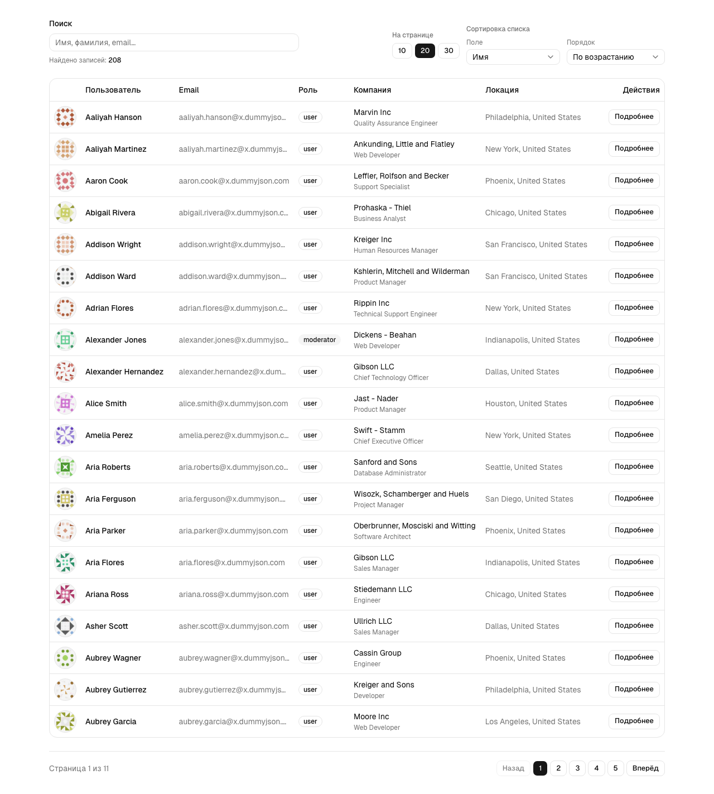
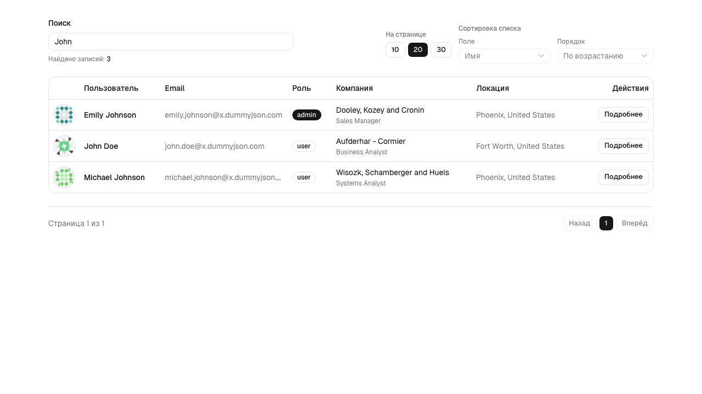

# Users Dashboard (DummyJSON)

Тестовое задание: дашборд со списком пользователей на данных [DummyJSON Users API](https://dummyjson.com/docs/users).

## Запуск

Требуется **Node.js 20+** (рекомендуется актуальный LTS).

```bash
npm install
npm run dev
```

Откройте [http://localhost:3000](http://localhost:3000).

Сборка и прод-режим:

```bash
npm run build
npm run start
```

Переменная окружения (опционально): базовый URL API, если нужен прокси или мок.

```bash
# .env.local
NEXT_PUBLIC_DUMMYJSON_URL=https://dummyjson.com
```

## Возможности

- Таблица пользователей: аватар, ФИО, email, роль, компания, город/страна.
- **Пагинация** и размер страницы (10 / 20 / 30) с отражением в **URL** (`page`, `limit`).
- **Поиск** по API (`/users/search`) с debounce ~360 ms; при поиске сбрасывается страница на первую.
- **Сортировка** по полям `firstName`, `lastName`, `email` и порядок asc/desc через query-параметры API (при активном поиске сортировка отключена в UI — отдельный endpoint поиска не комбинируется с `sortBy` в запросе).
- **Карточка пользователя** в модальном окне: загрузка профиля по `id` прямым `fetch` к DummyJSON из браузера (`src/api/users.ts`); пароль и банковские поля из ответа не используются.

## Скриншоты

| Список и пагинация | Поиск |
| --- | --- |
|  |  |

Файлы скриншотов: [`docs/screenshots/`](docs/screenshots/).

## Почему сделано так

1. **Next.js (App Router) + TypeScript** — ожидаемый стек по ТЗ, типобезопасность и предсказуемая структура (`src/app/page.tsx`, Server Components для первого рендера списка).
2. **Состояние в URL** — `page`, `limit`, `q`, `sortBy`, `order` сериализованы в query; список можно открыть по прямой ссылке, проще отлаживать и демонстрировать.
3. **Слой `src/lib/dummyjson`** — запросы списка и разбор query; клиентская деталка — в **`src/api`** (обычный `fetch`, без Next Route Handlers).
4. **Клиент только там, где нужен интерактив** — debounce поиска и диалог деталей; пагинация и сортировка — ссылки (`next/link`), данные таблицы приходят с сервера при навигации.
5. **shadcn/ui** — готовые доступные примитивы (таблица, диалог, поля ввода) без тяжёлого дизайн-фреймворка; стили согласованы с Tailwind v4.
6. **Безопасность демо-данных** — в модалке показываются только «безопасные» поля профиля; пароли и финансовые данные из ответа API намеренно не выводятся.

## Структура проекта

- [`src/app/`](src/app/) — маршруты и layout (`page.tsx`, `globals.css` и т.д.).
- [`src/components/users-dashboard/`](src/components/users-dashboard/) — только компоненты фичи (без вложенных `components/` / `hooks/` / `lib/`).
- [`src/hooks/`](src/hooks/) — `use-dashboard-url` (href + replace), `use-debounced-search`, `use-user-detail`.
- [`src/lib/dashboard-url.ts`](src/lib/dashboard-url.ts) — сериализация query и `createDashboardHref`.
- [`src/lib/users-dashboard/`](src/lib/users-dashboard/) — константы UI, форматирование, пагинация, типы пропсов фичи.
- [`src/lib/dummyjson/`](src/lib/dummyjson/) — запрос списка, разбор query, общий `readJson` для ответов API.
- [`src/api/users.ts`](src/api/users.ts) — клиентский `fetch` деталки пользователя по `id` (DummyJSON, без чувствительных полей в объекте).

## Линтинг

```bash
npm run lint
```
